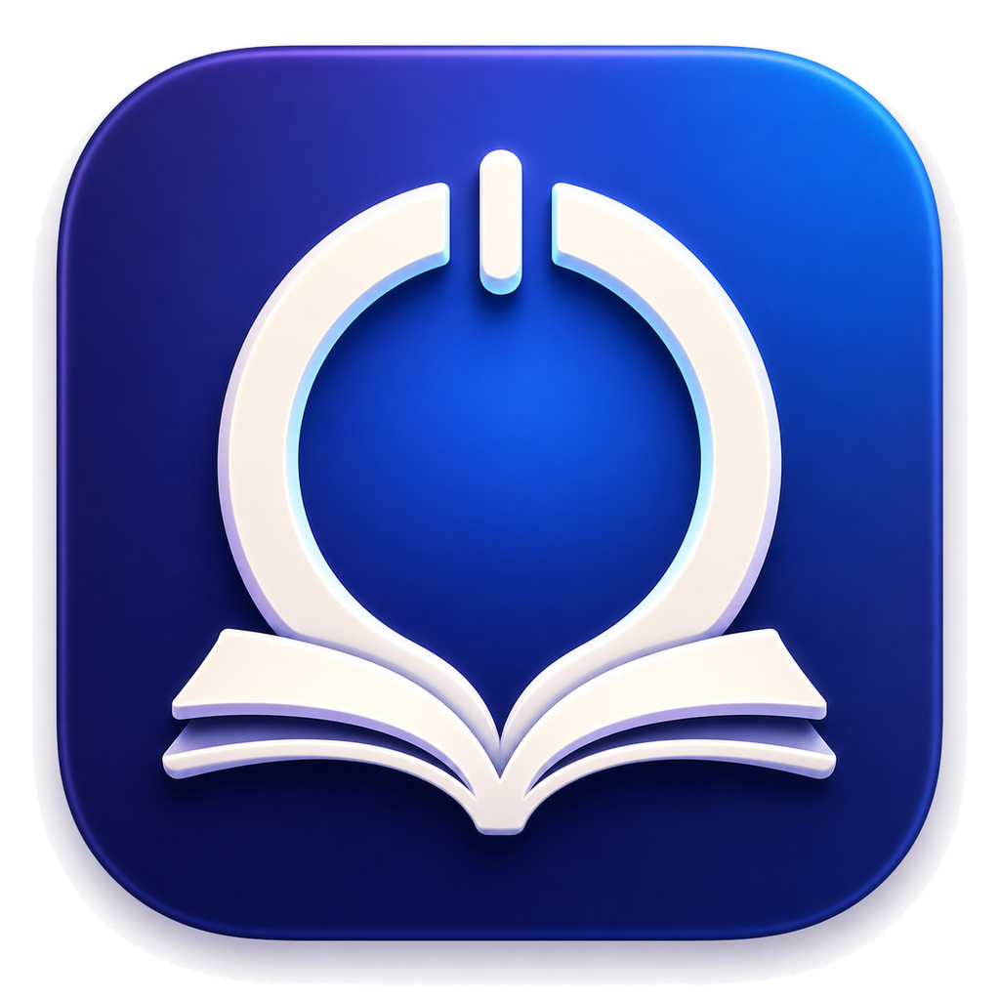

# Study Block



Study Block is a native macOS focus app for keeping a study session visible and
reducing distractions while it runs. It has a regular app window, a menu bar
control, and a small floating timer.

**Status:** active open-source macOS app. The latest published release verified
for this repository is **v1.1.0** (1 September 2026).

## Features

- Timed presets and an open-ended session option
- A draggable, always-on-top floating timer
- Chrome tab enforcement that redirects blocked sites during a session
- An app nudge ladder: reminder, short allowance, warning, then a cooperative
  quit request
- Strict mode with shorter escalation timing and no snoozing
- Optional session-scoped Do Not Disturb and music pausing
- Website favicons and native app icons with fast local caching and fallbacks
- Editable study sites, blocked sites and apps, presets, and defaults
- Settings from the ready screen, app menu, or Command-Comma
- Local session history, daily focus time, streaks, and most-blocked sites/apps
- Launch at login and interrupted-session recovery

Study sites take precedence over the blocklist. Google, ChatGPT, and Claude are
suggested as common work sites, but they can be blocked if you add them.
Settings, session checkpoints, and history stay on your Mac, and Study Block
never force-quits another app.

Do Not Disturb is released when a session stops or expires, when the Mac
sleeps, and before Study Block quits, restoring the Focus state that existed
before the session.

## Download

Download the current DMG from the permanent
[latest-release link](https://github.com/Jay-2212/study-block/releases/latest/download/StudyBlock.dmg).

The [v1.1.0 release page](https://github.com/Jay-2212/study-block/releases/tag/v1.1.0)
also includes `StudyBlock.dmg.sha256` for checksum verification.

1. Open `StudyBlock.dmg`.
2. Drag **Study Block** to **Applications**.
3. Because this build is unsigned and not notarized, Control-click or
   right-click the app in Applications, choose **Open**, then confirm **Open**.
   This is normally required only the first time.

The release is built for Apple silicon.

## Requirements

- macOS 15 or later
- Google Chrome for tab enforcement
- Apple silicon for the downloadable build

The source project targets macOS 15. Intel support is not currently advertised
or verified for the published DMG.

Depending on the features you enable, macOS may ask for:

- **Automation** to inspect and redirect Google Chrome tabs or pause music;
- **Accessibility** only if you turn on Do Not Disturb, and not on every session start;
- **Focus status** and **notifications** for the optional session behavior.

Study Block does not require Screen Recording permission.

## Build from source

You need macOS 15 or later and either Xcode or the Apple Command Line Tools.
Clone the repository, then run from the project root:

```sh
git clone https://github.com/Jay-2212/study-block.git
cd study-block
./script/build_and_run.sh --verify
```

The script uses Xcode when available. Otherwise, it compiles with the Apple
Command Line Tools, creates an ad-hoc signed app bundle, launches it, and checks
that the process is running.

For an optimized Release build:

```sh
./script/build_and_run.sh --release --verify
```

Run the focused smoke tests with:

```sh
./script/run_smoke_tests.sh
```

Build and verify the current versioned DMG with:

```sh
./script/package_release.sh
```

With Command Line Tools, the built app is written to
`.build/Release/Study Block.app`. Xcode builds use `.build/DerivedData`.

## Privacy and behavior

Chrome inspection runs only during onboarding and active sessions. Study Block
stores normalized domains rather than full browsing URLs. It suspends
session-owned enforcement across sleep and restores Chrome tabs it redirected
when a session stops or the app quits normally.

To display website favicons, the app may request
`https://<domain>/favicon.ico`. The domain can therefore observe that request;
favicon retrieval is cached locally when successful. The app has no account or
hosted backend in this repository. Settings, session checkpoints, history, and
cached icons are stored locally on the Mac.

## Limitations

- Enforcement is cooperative and can be bypassed by closing, disabling, or
  working around the app. It does not guarantee concentration.
- The app may request another application's cooperative termination, but it
  never force-quits applications and has no privileged helper.
- Website enforcement targets Google Chrome and needs Chrome to be available;
  other browsers are not supported by the current implementation.
- It is a personal desktop utility, not enterprise device-management software.
- A sleeping Mac, a locked session, denied permissions, or a failed Chrome
  automation request can suspend or prevent enforcement.

## Project layout

```text
StudyBlock/
├── App/          App entry point and scene composition
├── Models/       Settings, sessions, policy, and escalation state
├── Services/     Chrome, workspace, panel, and termination adapters
├── Stores/       App-wide session, history, and enforcement coordinators
├── Views/        Onboarding, settings, timer, menu bar, and nudges
├── Resources/    App metadata, entitlements, and bundled icon
└── Assets.xcassets/
StudyBlockTests/  Focused policy, persistence, and state-machine tests
script/           Canonical build, launch, and smoke-test commands
Design/           Source artwork, including the 1024 px icon master
```

## License

Study Block is available under the [MIT License](LICENSE).
